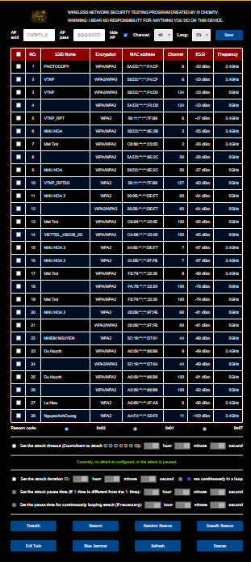

# CHOMTV-RTL8720DN-Evil-Twin-Deauther
## Instruct: https://youtu.be/7pxITkirF0M
## Default Local IP: 172.0.0.1
## Default SSID: CHOMTV
## Default PASS: @@@@2222
## Restore defaults: Hold 10s Burn button
## Note: The jammer function needs to be connected to the ESP32 module to work
# Relies on the following libraries (Thank All):
## https://github.com/tesa-klebeband/RTL8720dn-Deauther
## https://github.com/A3ST1CODE/RTL8720DN-Captive
## https://github.com/khoih-prog/FlashStorage_RTL8720
# ERASER tool from :
## https://github.com/Cancro29/NETHERCAP

